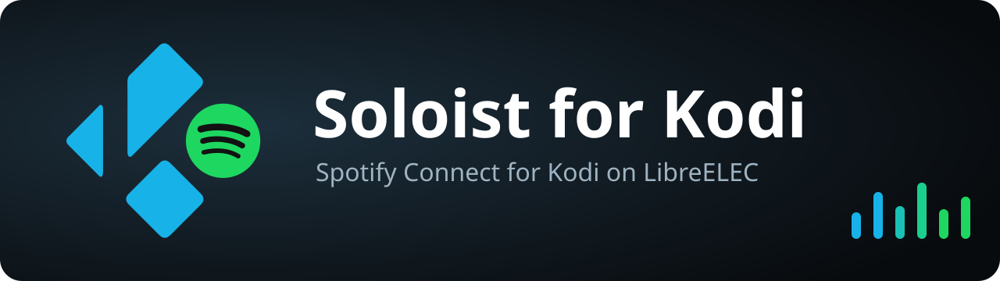

# Soloist für Kodi

**Spotify Connect für Kodi auf LibreELEC: Die Box erscheint in der Spotify-App
als Gerät, und die Musik läuft über Kodi, mit Titel und Cover auf dem
Fernseher.**

Grundlage ist [Spotify Soloist](https://developer.spotify.com/documentation/soloist),
der offizielle Headless-Client von Spotify. librespot-basierte Lösungen
scheitern bei neu angelegten Spotify-Accounts oft am „Audio key error“.
Soloist als offizieller Client sollte davon nicht betroffen sein.

> Dieses Addon ist ein inoffizielles Projekt und steht in keiner Verbindung zu
> Spotify. Soloist selbst ist proprietäre Software von Spotify und wird zur
> Laufzeit direkt von Spotify heruntergeladen. Es ist nicht Teil dieses Repos.

---

## Voraussetzungen

| | |
|---|---|
| Gerät | Raspberry Pi 5 (aarch64), getestet. aarch64, armv7 und x86_64 sollten laufen. |
| System | LibreELEC 12 mit Kodi 21 „Omega“ |
| Addon | **Docker** (`service.system.docker`) aus dem LibreELEC-Repository |
| Spotify | ein **Soloist-API-Key**, erzeugt mit einem Premium-Account. Verbinden können sich danach laut Spotify auch Free-Accounts. |

## Installation

1. **API-Key erzeugen:** mit dem Premium-Account unter
   <https://developer.spotify.com/dashboard/soloist> einloggen und einen Key anlegen.
2. **Key auf der Box ablegen**, ohne dass er im Shell-Verlauf landet:
   ```
   mkdir -p /storage/.config/soloist && chmod 700 /storage/.config/soloist
   read -rs KEY && printf '%s' "$KEY" > /storage/.config/soloist/api_key && unset KEY
   chmod 600 /storage/.config/soloist/api_key
   ```
   Nach `read` den Key einfügen und Enter drücken. Dabei wird nichts angezeigt.
3. Das aktuelle `service.soloist-*.zip` aus den
   [Releases](https://github.com/willheisenberg/kodi-soloist/releases)
   herunterladen, oder selbst bauen mit `./scripts/build-zip.sh`.
4. In Kodi einmalig **Einstellungen → System → Add-ons → Unbekannte Quellen**
   erlauben, dann **Add-ons → Aus ZIP-Datei installieren**.

Beim ersten Start baut das Addon das Container-Image `kodi-soloist:<version>`.
Auf einem Pi 5 dauert das etwa eine Minute. Danach erscheint die Box in der
Spotify-App unter „Geräte“ als **Kodi**.

## Bedienung

- **In der Spotify-App** die Box als Gerät wählen und abspielen. Kodi zeigt
  Titel, Interpret und Cover.
- **Pause, Weiter und Stopp in Kodi** werden an Spotify weitergegeben.
- **Startet Kodi etwas anderes**, etwa ein Video, pausiert Spotify.
- **In Kodi** steht Soloist bei den Programm-Addons. Ein Klick zeigt den
  Status („Spielt: …“, „Bereit …“) und bietet *Spotify-Gerät freigeben* und
  *Einstellungen*. Der Dienst selbst liegt unter *Meine Add-ons → Dienste*.
- **Lautstärke:** Standardmäßig regelt die Spotify-App die Lautstärke. Wer nur
  am Receiver regeln will, schaltet in den Einstellungen *Lautstärke immer auf
  100 % halten* ein. Verschiebt dann jemand den Regler in der App, springt er
  zurück.

## Einstellungen

| Einstellung | Standard | |
|---|---|---|
| Gerätename | `Kodi` | Name in der Spotify-App |
| Lautstärke immer auf 100 % halten | aus | An: Soloist bleibt auf 100 %, geregelt wird nur am Receiver |
| Anfangslautstärke | 80 % | nur sichtbar, wenn die Lautstärke nicht auf 100 % gehalten wird |
| Laufende Kodi-Wiedergabe nicht unterbrechen | aus | An: Spotify pausiert, solange Kodi etwas anderes abspielt |
| Cache-Größe | 500 MB | *Erweitert* |
| WebSocket-Port / RTP-Port | 24879 / 23433 | *Erweitert*, nur localhost. Den RTP-Port nicht ändern, wenn der PartyQueue-Bot mitläuft. |

## Zusammenspiel mit dem PartyQueue-Bot

Mit dem [KodiMediaBot](https://github.com/willheisenberg/KodiMediaBot) können
sich Bot und Spotify gegenseitig unterbrechen, ohne dass etwas verloren geht:

- **Spotify übernimmt:** Der Bot parkt seine Warteschlange bzw. merkt sich den
  laufenden Radiosender. Das Panel zeigt `Spotify: Titel – Interpret`.
- **Spotify ist weg oder bleibt 30 Sekunden pausiert:** Der Bot setzt das
  unterbrochene Video an der alten Stelle fort bzw. startet den Sender neu.
- **Stopp im Bot:** Die Box gibt das Spotify-Gerät frei, und die App legt die
  Wiedergabe zurück aufs Handy.

Dafür schicken sich Addon und Bot Kodi-Benachrichtigungen:

| Richtung | Meldung | Bedeutung |
|---|---|---|
| Addon → Clients | `Other.soloist_takeover` (sender `service.soloist`) | Spotify startet gleich, und zwar *bevor* Kodi den vorherigen Titel als gestoppt meldet |
| Client → Addon | `JSONRPC.NotifyAll` mit `message: "soloist_release"` | Spotify-Gerät freigeben (`deactivate`) |

## Aufbau

```
Spotify-App ──Connect──▶ Soloist (Docker-Container, isoliert)
                            │ PulseAudio (Senke "soloist")
                            ▼
                   module-rtp-send ──▶ rtp://127.0.0.1:23433 ──▶ Kodi-Player
                            ▲
   Kodi-Addon ◀──WebSocket 127.0.0.1:24879── Titel, Cover, Status
```

- **Soloist ist closed source** und läuft deshalb in einem Container: als
  normaler Benutzer (uid 1000), mit schreibgeschütztem Dateisystem, ohne
  Capabilities und mit `no-new-privileges`. Er bekommt nur den
  PulseAudio-Socket, ein eigenes Volume `soloist-data` und das Host-Netzwerk,
  das Spotify Connect zum Auffinden im WLAN braucht. An `/storage`, Tokens
  anderer Dienste und Docker kommt er nicht heran.
- **Das Binary ist nicht im Addon enthalten**, weil Spotify die Weitergabe
  verbietet. Der Container lädt es bei jedem Start von Spotifys CDN. Builds
  laufen nach 90 Tagen ab (Exit-Code 10), dann genügt ein Neustart.
- **Secrets** (API-Key, PulseAudio-Cookie) gehen über stdin in den Container,
  nicht als Docker-Argument oder eingebundene Datei. Weil Soloist den Key nur
  als Kommandozeilenargument annimmt, ist er während der Laufzeit in `ps` auf
  der Box sichtbar, und zwar nur für root.
- Das Weiterleiten des Tons per PulseAudio-Senke und RTP stammt aus dem
  [Librespot-Addon von LibreELEC](https://github.com/LibreELEC/LibreELEC.tv/tree/master/packages/addons/service/librespot)
  (GPL-2.0-only).

## Fehlersuche

Die wichtigsten Ereignisse stehen in `kodi.log` mit dem Präfix
`service.soloist:`. Jeden Befehl an Soloist und jedes Ereignis von Soloist
sieht man erst mit eingeschaltetem Debug-Logging in Kodi.

## Entwicklung

```
python -m pytest -q     # Tests für die Teile ohne Kodi (WebSocket, Metadaten)
ruff check .
./scripts/build-zip.sh  # dist/service.soloist-<version>.zip
```

Kodi auf LibreELEC 12 bringt Python 3.11 mit, der Code muss dazu kompatibel
bleiben. Icon, Fanart und Banner entstehen aus den SVG-Dateien in `assets/`.

## Lizenz

GPL-2.0-only, siehe [LICENSE](LICENSE).
